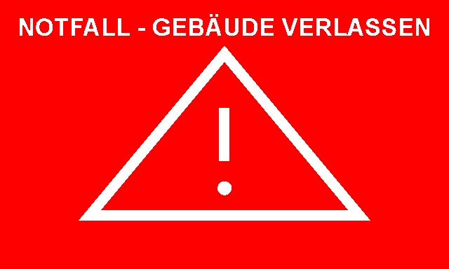

# VIT Tag Renderer

Small Fastify Server to generate schedule images for [OpenEPaperLink](https://github.com/OpenEPaperLink/OpenEPaperLink) tags.

## Getting started
### Prerequisites
- [Node.js](https://nodejs.org/) version 18 or higher.


### Install
1. Clone the repository.
2. Setup your `.env` file based on the provided `.env.example`.
3. Run `npm install`.

## Development Server
Start the development server on `http://localhost:3001` (.env PORT - default 3001):

```bash
# dev
npm run dev
```

## Production
Build and run the application for/in production:

```bash
# build
npm run build

# start 
npm run start
```


## Example
### Schedule

#### Request
```bash
curl --location 'localhost:3001/api/tag/schedule' \
--header 'Content-Type: application/json' \
--data '{
    "name": "Lehrsaal 2",
    "width": "640",
    "height": "384",
    "date": "11.06.2024",
    "url": "http://localhost:3000/tag/clx4gzo2400006i73q2j3elr5",
    "events": [
        {
            "desc": "M10 - Prüfungsleistung",
            "start": "08:00",
            "end": "09:35"
        },
        {
            "desc": "M10 - Prüfungsleistung",
            "start": "09:50",
            "end": "11:25"
        },
        {
            "desc": "M10 - Prüfungsleistung",
            "start": "11:40",
            "end": "13:15"
        },
        {
            "desc": "M10 - Party nach Abgabe",
            "start": "14:30",
            "end": "16:05"
        }
    ]
}'
```

#### Response


### Not configured

#### Request
```bash
curl --location 'localhost:3001/api/tag/configure' \
--header 'Content-Type: application/json' \
--data '{
    "width": "640",
    "height": "384"
    "url": "localhost:3000/tag/clx4gzo2400006i73q2j3elr5"
}'
```

#### Response


### Emergency 

#### Request
```bash
curl --location 'localhost:3001/api/tag/emergency' \
--header 'Content-Type: application/json' \
--data '{
    "width": "640",
    "height": "384"
}'
```

#### Response
